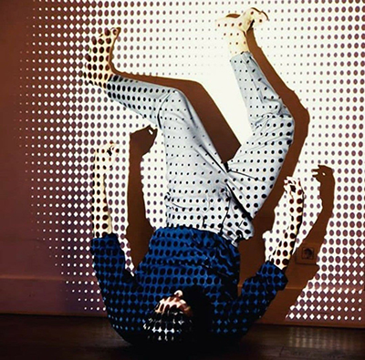
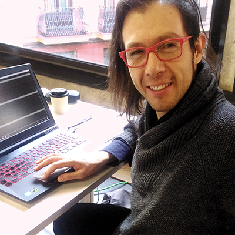
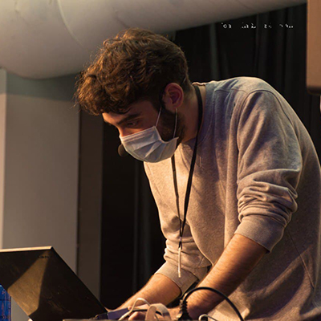

# AI-to-people
## La AI necesita ser democratizada o emancipada. Libertad para los replicantes ya!!!
 
En este repositorio se encontrarán los contenidos del taller AI desarrollado especialmente para las hermanas de espacio LABTINOAMERICA.

En este taller abordaremos los elementos fundamentales de la AI, teóricos y prácticos, a través de diversas librerías de JavaScript para ver sus posibles aplicaciones e implicaciones en el arte y en la sociedad. 

Este taller tiene un especial enfoque en la aplicación de la AI para el cuidado del medio ambiente, en particular con el tema de la contaminación plástica y el reciclado.

<https://www.instagram.com/lab.tinoamerica.xy/>

## Slides

Aquí encontraras la [presentación del workshop](https://docs.google.com/presentation/d/1WIzgV2hw33gVqTYQRZylk09ymGXBEr7W_pJ6FJ2H2L4/edit?usp=sharing)

## Materiales del concurso

<https://github.com/JoakuDeSotavento/ArEs-NuTec>

## Libros

Esta es una selección de los mejores libros para estos menesteres

--------  drive.google.com/file/d/1EdUHApmi8gDPhFTLEqCSNj-p55fkkJvF/view?usp=sharing -------------

## Ejemplos

<https://openprocessing.org/user/278519?view=activity>

## Autores

**Alfredo Miralles**

Madrid, 1987. Intérprete de danza contemporánea y gestor cultural. Su trabajo en producción de artes escénicas aúna sus dos trayectorias profesionales: la danza y la gestión de proyectos. Combina su trabajo desde 2009 en el Aula de las Artes de la Universidad Carlos III de Madrid con la escritura y reflexión en torno a la danza, principalmente como crítico en la Revista SusyQ. En la actualidad está inmerso en la búsqueda de un lenguaje propio en la creación audiovisual en combinación con el arte del movimiento.

[Instagram](https://www.instagram.com/alfredomiralles) |
[YouTube](https://www.youtube.com/user/alfredomirallesbenit) |

**Joaquín R. Díaz Duran**
aka **Joaku de Sotavento**

Joaquín Díaz Durán (1982, Ciudad de México) actualmente cursa el programa de Doctorado en Investigación en Humanidades Artes y Educación de la UCLM (España). Desarrolla su investigación Inside The Stomach of a Robot en vinculación a Medialab-Prado.
El año pasado presentó su trabajo con la Interfaz Cyborg en los festivales Scratxe#13 en Vitoria-Gasteiz, Ctrl Art Supr en el Hostal Bastardo en Madrid y en colaboración con el cineasta Francisco Bouzas presentan la performance Un Juego Latente en Tabakalera-Donostia. Ha impartido talleres de arte interactivo, diseño de interfaces y robótica en la Fundación Telefónica de Madrid (Marzo 2019), en MediaLab Prado (Abril y Diciembre 2019) y en el Festival Future Places, Portugal (Octubre 2017). Del 2012 al 2015 formó parte del equipo de robótica del laboratorio de Birobotics de la UNAM encargado del diseño y construcción de la apariencia del robot Justina, participando en los concurso Robocup (México 2012, Holanda 2013, Brasil 2014 y China 2015) y RockIn (Portugal 2015).

[twitter](https://twitter.com/joaku_Sotavento) |
[web](https://www.arterobotico.com) |
[github](https://github.com/JoakuDeSotavento) |

**Jorge Marcos Chávez**

Madrid, 1998. Estudiante de ingeniería informática, teclista y productor de música electrónica. Casi graduado por la Universidad Carlos III de Madrid, y buscando aplicar todo lo aprendido en el ámbito audiovisual. Músico desde los 10 años, haciendo electrónica desde hace 7, y  aficionado a la generación de gráficos y sonido por ordenador, intentando complementar ambas disciplinas.

[Instagram](https://www.instagram.com/Jorgeelalto) |
[github](https://github.com/Jorgeelalto) |
[web](https://www.7thpyramid.es) |